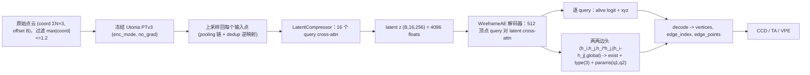

<div align="center">

# CAD Wireframe 神经压缩挑战赛 — WireframeAE 分支

<a href="https://pytorch.org/get-started/locally/"></a>
<a href="https://pytorchlightning.ai/"></a>
<a href="https://github.com/ashleve/lightning-hydra-template"></a><br>

</div>

比赛主页: https://mathmagic-official.github.io/AICAD/

数据集以及 Baseline: https://pan.ustc.edu.cn/share/index/8902361d3b5745f78245

## 框架概览

`点云 -> 冻结 Utonia PTv3 + 可训练 compressor -> latent z(16×256=4096) -> WireframeAE 解码器 -> 参数化 wireframe`。

整条流水线是一个**端到端单阶段压缩自编码器**:编码器把原始点云压成 `16×256` 的 latent(即比赛提交内容,4096 floats 上限),
解码器**仅凭这个 latent** 用 DETR 风格的集合预测重建出结构化、参数化的 wireframe 图(直线 / 圆弧 / Bezier)。没有两阶段拼接,
没有 KL(latent 是确定性的)。



| 模块 | 作用 |
| --- | --- |
| **UtoniaEncoder** (冻结 `Utonia PTv3` + 可训练 `LatentCompressor`) | **原始变长点云**(打包成 `coord (ΣN,3)` + `offset (B,)`,PTv3 原生格式) → 体素去重(每体素留一点,对齐 Utonia 的 GridSample) → 冻结的 [Utonia](https://huggingface.co/Pointcept/Utonia) 预训练 PTv3 编码器(`enc_mode`、`eval`+`no_grad`,确定性)出最粗粒度的逐体素特征 → 沿 `GridPooling` 的 `pooling_parent`/`pooling_inverse` 链把特征**上采样回 PTv3 输入(去重)分辨率**,再用去重逆映射散射回**每个原始输入点** → 16 个 query 的 compressor 池化成 latent `z (B,16,256)`。`16×256=4096` floats 正好是比赛 latent 预算上限。backbone 冻结、只训 compressor。 |
| **WireframeAE** (顶点 query 解码器 + 两两边头) | 仅从 latent 重建 wireframe。`512` 个可学习**顶点 query** 通过 `nn.TransformerDecoder` 对 16 个 latent token 做 cross-attention;**顶点头**逐 query 输出 `alive` logit(是否真实顶点)+ `xyz`;**边头**对顶点 query 的**点对** `(i,j)` 打分,输入 `[h_i, h_j, h_i*h_j, |h_i-h_j|, global]`(`global` = query token 均值,注入全局形状信息),输出 `exist` logit + 曲线 `type`(3)+ 两个内部 anchor `q1,q2`(6),边端点 `a,b` 即两个 query 预测的 `xyz`。详见 `src/models/wireframe_ae.py`、`src/recon/wireframe.py`。 |

## 目标 / 监督 (target)

每个样本保留**原生 GT wireframe 图**(顶点 + `edge_index`),并为每条边附带解码器要回归的逐边监督:

- `edge_type`:`0=line / 1=arc / 2=bezier`,由 `_fit_curve_type` 按几何残差判定;
- `edge_params (E,2,3)`:曲线在弧长 `t=1/3`(`q1`,靠近起点)与 `t=2/3`(`q2`,靠近终点)处的坐标。

坐标**全程保持原始**(不归一化):整条流水线在原始坐标系训练与监督。点云若为空、`max(|coord|) > 1.2`,或顶点数 `> max_vertices=512`
(= 解码器 query 数上限)、边数超过 `max_edges`(默认不限),该样本会被**跳过**(loader 重试下一个文件)。

## 损失(DETR 风格集合预测)

`collate_ae_batch` 把变长点云打包成 `coord/offset`,并以列表形式携带逐样本 GT 图供匈牙利匹配:

- **匈牙利匹配**:用 `scipy.optimize.linear_sum_assignment` 把 `512` 个顶点 query 与 GT 顶点按 **xyz L1** 代价匹配;
- `loss_vertex`:匹配上的顶点坐标 L1;
- `loss_alive`:顶点存活 BCE(匹配=正例,其余=负例;正例稀少故 `alive_pos_weight` 上权重);
- `loss_edge`:边存在 BCE,在**匹配 query 的点对**上计算(正例 = GT 边映射到的 query 对,负例 = 其它匹配点对,按 `edge_neg_ratio` 下采样);
- `loss_edge_type`:边曲线类型**类别加权** CE(权重 `[1,3,9]`,直线占多数、bezier 最稀有);
- `loss_edge_param`:边 anchor `(q1,q2)` 的 L1;
- `loss_curve_geom`:按预测类型/参数采样曲线与 GT 曲线点的 Chamfer(权重小,可选)。

无 KL(确定性 latent)。验证时解码并计算 `val/{score,ccd,ta,vpe}`,checkpoint 按 `val/score` 选优(越大越好)。

## 训练

依赖:点云栈(Utonia PTv3 需 `spconv` / `flash-attn` / `torch_scatter` / `timm`)+ `pytorch_lightning` / `torchmetrics`;
验证指标用 `pytorch3d`(KNN chamfer);匈牙利匹配用 `scipy`。Utonia 权重默认从本地 `logs/utonia/utonia.pth` 加载
(在 `configs/ae*.yaml` 的 `pc_encoder.utonia` 配置;也可填 HF 名 `utonia` + `utonia_repo_id: Pointcept/Utonia` 自动下载)。

```bash
# 单 GPU
python -m src.main fit --config configs/data.yaml --config configs/ae.yaml
# 也可以： bash scripts/run.sh train

# 8x A800 DDP
python -m src.main fit --config configs/data.yaml --config configs/ae_ddp.yaml
# 也可以： bash scripts/run.sh train_ddp
```

显存/速度杠杆:`decoder.{num_layers,d_model,nhead}`、`data.batch_size`、`max_decode_vertices`(验证解码时两两边的规模)、`edge_neg_ratio`。

## 推理 / 提交

提交导出是**单次前向**(encode → latent → decode),直接在原始坐标系写出 wireframe(**不做反归一化**),并把 `16×256` latent
展平成 `(K,)` 写进每个样本 npz 与 `latent_pack.npz`。

```bash
# 单 GPU
python scripts/export_submission.py --ckpt <ae.ckpt 目录或文件> --out-dir logs/submission
# 也可以： CKPT=<ae.ckpt> bash scripts/run.sh export_submission

# 8-GPU 数据并行(每 GPU 一个 worker,自动合并 + 打包 submission.zip)
python scripts/export_submission.py --spawn 8 --ckpt <ae.ckpt> --out-dir logs/submission

# 断点续跑
python scripts/export_submission.py --spawn 8 --ckpt <ae.ckpt> --out-dir logs/submission --resume
```

提交布局:

```text
submission/
    latent_pack.npz                 # stems (N,) + latents (N, K<=4096)
    sample_edge/<stem>.npz
        latent       : (K,) float32
        vertices     : (V, 3) float32
        edge_index   : (E, 2) int32
        edge_points  : (E, 32, 3) float32
        num_vertices : () int32
        num_edges    : () int32
```

## 可视化

```bash
# val：input point cloud | 预测 wireframe(+逐样本 score/ccd/ta/vpe) | GT wireframe
python scripts/vis_ae_val.py --ckpt <ae.ckpt> --split val --num 6

# test(无 GT)：额外画出 baseline submission 列对照
python scripts/vis_ae_val.py --ckpt <ae.ckpt> --split test --num 8 --out logs/ae_test.png
```

`scripts/make_split.py` 生成 `data/split.json`;`scripts/render_wireframe.py` 用于把单个 wireframe npz 渲染成图。
