<div align="center">

# CAD Wireframe 神经压缩挑战赛 — VQVAE 分支

<a href="https://pytorch.org/get-started/locally/"></a>
<a href="https://pytorchlightning.ai/"></a>
<a href="https://github.com/ashleve/lightning-hydra-template"></a><br>

</div>

比赛主页: https://mathmagic-official.github.io/AICAD/

数据集以及 Baseline: https://pan.ustc.edu.cn/share/index/8902361d3b5745f78245

## 框架概览

`点云 -> 冻结 Utonia PTv3(多尺度)-> 每尺度 compressor -> 每尺度 ResidualVQ -> 拼接索引(≤4096,提交)-> 联合顶点+边解码器 -> wireframe`。

整条流水线是一个**端到端单阶段离散自编码器(VQVAE)**:编码器把原始点云压成**多尺度**的连续 token,每个尺度用独立的残差向量量化器(ResidualVQ)离散成码本索引;**拼接后的扁平索引**(`Σ_s N_s·n_q ≤ 4096`)即比赛提交内容。解码器**仅凭这些索引**(索引 → 码本 → `z_q` → 解码器)用一个**联合顶点+边集合解码器**重建 wireframe:几何与拓扑被解耦到专门的 head ——

- **顶点 query** → 顶点 head:存在性 + 坐标(几何干净,不靠端点合并);
- **边 query** → 边 head:存在性 + **12 维曲线 VAE latent**(`latent_channels 3 × latent_len 4`);
- **边↔顶点关联矩阵 `A`**:显式拓扑(不用 union-find,也不用 V×V 两两分类)。

一个**逐曲线 VAE**(`AutoencoderKL1D`)作为可训练子模块与解码器**联合训练**(不分阶段、不冻结),把每条边的 latent 解出精确曲线;推理时按 `A` 给每条边取 top-2 顶点为端点,再把解出的规范曲线 denorm 锚到端点。VQ commitment loss(连续 `z` 预热后 ramp)训练码本,曲线 VAE 额外带一个 KL 项。

```mermaid
flowchart LR
  PC["原始点云 (coord ΣN×3, offset B)"] --> ENC["冻结 Utonia PTv3 (enc_mode, no_grad)"]
  ENC --> MS["取若干 enc stage 的逐体素特征(不上采样)"]
  MS --> COMP["每尺度 compressor:N_s 个 query cross-attn"]
  COMP --> Z["多尺度连续 token z_s (B,N_s,256)"]
  Z --> RVQ["每尺度 ResidualVQ(n_q 级)"]
  RVQ --> IDX["拼接扁平索引 (B, ΣN_s·n_q ≤4096) = 提交"]
  IDX --> ZQ["decode_indices:索引 -> 码本 -> z_q"]
  ZQ --> DEC["联合解码器:512 顶点 query + 512 边 query(各自 self-attn + 对 z_q cross-attn + 顶点↔边相互 cross-attn)"]
  DEC --> VH["顶点 head:存在性 + xyz"]
  DEC --> EH["边 head:存在性 + 12 维曲线 latent"]
  DEC --> INC["关联:sigmoid(edge_proj·vertex_proj^T)=A (Ne×Nv)"]
  EH --> CVAE["曲线 VAE 解码(联合训练)-> 规范曲线"]
  VH --> RECON
  INC --> RECON["recon:每条边按 A 取 top-2 顶点为端点,曲线 denorm 锚到两端"]
  CVAE --> RECON
  RECON --> WF["vertices, edge_index, edge_points"]
  WF --> MET["CCD / TA / VPE"]
```



| 模块 | 作用 |
| --- | --- |
| **UtoniaEncoder**(冻结 `Utonia PTv3` + 每尺度可训练 `LatentCompressor`) | **原始变长点云**(打包成 `coord (ΣN,3)` + `offset (B,)`)→ 体素去重 → 冻结的 [Utonia](https://huggingface.co/Pointcept/Utonia) 预训练 PTv3 编码器(`enc_mode`、`eval`+`no_grad`,确定性)→ 沿 `GridPooling` 的 `pooling_parent` 链取**若干 enc stage 的逐体素特征**(**不上采样**,每尺度保持其原生分辨率;通道 `enc_channels[stage]` 从 ckpt 配置读取)→ 每尺度一个 compressor 池化成 `z_s (B,N_s,256)`,输出多尺度 token 列表(细→粗)。默认用**全部 5 个 enc stage**(`scale_stages=[0..4]`),token 分配 `scale_tokens=[192,128,96,64,32]`(细尺度给更多 token 保细节);`compressor_heads=6` 须整除每个被用 stage 的通道(`54/108/216/432/576`)。backbone 冻结、只训 compressor。详见 `src/models/utonia_encoder.py`。 |
| **MultiScaleResidualVQ**(每尺度独立 `ResidualVQ`) | 每尺度用各自的残差 VQ(`n_q` 级)把连续 token 量化成索引;**拼接成扁平索引**(固定 layout:尺度→token→量化级),`总索引 = Σ_s N_s·n_q`,**构造时**校验 `≤4096`(默认 `5` 尺度 `512×8 = 4096` 顶满)。`codebook_size` 支持**逐尺度** list(粗尺度 token 少,缩小码本以匹配利用率、抗坍塌)。`forward` 返回直通 `z_q`、扁平索引与 commitment loss;`decode_indices` 仅凭扁平索引重建出 `z_q`(保证 索引→wireframe 的 round-trip)。`eval` 模式自动冻结码本(EMA 关闭)。依赖 `vector-quantize-pytorch`(自行安装)。详见 `src/models/quantizer.py`。 |
| **JointSetDecoder**(联合顶点+边集合解码器) | 仅从多尺度 `z_q` 重建 wireframe。各尺度 `z_q` 投影到 `d_model` 并加上**尺度 embedding** 后 concat 成 memory;`512` 个**顶点 query** 与 `512` 个**边 query** 经 `N` 个 `JointDecoderLayer`,每层(`norm_first`)= 各集合内 **self-attn** + 对 `z_q` 的 **cross-attn** + **顶点↔边相互 cross-attn**(取快照避免先后偏置)+ 各自 FFN。Head:顶点 head(存在性 + `(Nv,3)` 坐标,`coord_tanh` 压进 `[-1,1]`)、边 head(存在性 + `12` 维曲线 latent)、低秩**关联 head** `A=sigmoid((He·W_e)(Hv·W_v)^T/√k)`(`Ne×Nv`)。详见 `src/models/joint_set_decoder.py`。 |
| **曲线 VAE**(`AutoencoderKL1D`,联合训练) | 纯 PyTorch 的注意力/token 逐曲线 VAE:`encode` 把规范化曲线压成小 token latent,`decode(z,t)` 在任意参数 `t` 处解码出曲线(端点钉在 `[-1,0,0]`/`[1,0,0]`)。作为解码器的**可训练子模块**与主任务**联合更新**(不分阶段、不冻结),避免把分阶段 VAE 的重建误差烤进精度天花板。详见 `src/models/vae/`。 |
| **关联重建**(`assemble_wireframe`) | 保留 `sigmoid(vexist)>vthr` 的顶点、`sigmoid(eexist)>ethr` 的边(各带兜底 `min_vertices`/`min_edges`,永不输出退化结果);每条留下的边按 `A[e,:]` 在留下的顶点里取 **top-2**(强制两端不同、去**重复边**)为端点;`decode(lat)` 出规范曲线,按确定性**字典序端点规则**定向后用 `denorm_curves` 锚到两端点;最后去掉未被引用的顶点并重编号。详见 `src/recon/joint_wireframe.py`。 |

## 目标 / 监督 (target)

每个样本保留**原生 GT wireframe 图**:顶点 + `edge_index` + 每条边的有序采样点 `edge_points (E,P,3)`(其首/尾点即两端顶点)。顶点几何由顶点 head 直接回归,边形状由曲线 VAE latent 表达,拓扑由关联矩阵 `A` 承载。

坐标**全程保持原始**(数据集已归一化到 `[-1, 1]`,无需额外归一化)。点云若少于 `min_pc_points=100` 个点,或顶点数 `> max_vertices=512` 该样本会被**跳过**。曲线在喂给 VAE 前会按确定性的**字典序端点规则**定向再 `normalize_curves` 规范化,训练与推理一致,保证规范曲线起点/终点定义良好。

## 损失(联合集合预测 + VQ)

逐 shape、顺序无关的匈牙利匹配(`scipy.optimize.linear_sum_assignment`):

- **顶点匹配 / 损失**:在 `coord_L1 − w·sigmoid(vexist)` 上匹配顶点 query 与 GT 顶点,得到 GT 顶点→顶点 query 的映射 `qv_of_gt`;`loss_vexist` 标定存在性 BCE(匹配上的为正)、`loss_vcoord` 匹配顶点坐标 L1;
- **曲线 VAE 自编码锚定**:对 GT 规范曲线 `encode→sample→decode`,长度加权重建 L1(`loss_anchor`)+ 端点 L1(`loss_anchor_endpoint`)+ `kl_weight·KL`(`loss_kl`)——这条干净监督让 latent 空间始终有意义、防坍塌;
- **基于 `A` 的边匹配**:代价 `w_inc·(−logA[e,qa]−logA[e,qb]) + w_lat·‖lat[e]−sg(μ_k)‖₁ − w·sigmoid(eexist[e])`,`qa/qb` 是 GT 边两端点映射到的顶点 query,`μ_k` 是 GT 规范曲线经当前 encoder 的均值并 **stop-grad**(只当匹配用);`w_inc` 经 `match_warmup_steps`(`A` 早期随机)后再 ramp,先用 latent+存在性驱动匹配;
- **边损失**:`loss_eexist` 标定存在性 BCE;`loss_curve` 在**曲线空间**监督 `L1(decode(lat_pred[e]), GT 规范曲线)`(目标固定不漂移,经共享可训练 decoder)+ 端点项 `loss_curve_endpoint`;`loss_lat_reg` 很小权重的 on-manifold `L2(lat_pred, sg(μ_k))`;
- **关联损失** `loss_assoc`:在 `A` 上做 BCE,限制在**匹配边的行 / 匹配顶点的列**,并用 `pos_weight` 应对 2-of-Nv 的极稀疏;
- `loss_commit`:VQ commitment loss,经 `quant_warmup_steps`(先用连续 `z` 预热)后,权重 `0 → w_commit` 线性 ramp。

并按尺度记录码本 `perplexity`(`vq/perplexity_s*`)监控利用率/坍塌;验证时额外记录可观测性指标(`recon/nonempty_frac`、`recon/pred_vertices`、`recon/pred_edges` vs `recon/gt_*`)。验证时从 `z_q` 解码并在 `(vthr, ethr)` 网格上重算分数,checkpoint 按其中最优的 `val/score_best` 选优(越大越好),并记录最优阈值 `val/best_{vthr,ethr}`。

## 训练

依赖:点云栈(Utonia PTv3 需 `spconv` / `flash-attn` / `torch_scatter` / `timm`)、`pytorch_lightning` / `torchmetrics`、`pytorch3d`(KNN chamfer)、`scipy`(匈牙利匹配)、`einops` / `torchtyping`(曲线 VAE),以及 **`vector-quantize-pytorch`**(VQVAE 量化器,**自行安装**:`pip install vector-quantize-pytorch`)。Utonia 权重默认从本地 `logs/utonia/utonia.pth` 加载(在 `configs/vqvae*.yaml` 的 `pc_encoder.utonia` 配置)。

```bash
# 单 GPU
python -m src.main fit --config configs/data.yaml --config configs/vqvae.yaml
# 也可以： bash scripts/run.sh train

# 8x A800 DDP
python -m src.main fit --config configs/data.yaml --config configs/vqvae_ddp.yaml
# 也可以： bash scripts/run.sh train_ddp
```

`vqvae.yaml`(单 GPU)与 `vqvae_ddp.yaml`(8x A800 DDP)是**同一个模型**的单/多卡孪生配置,只有 `trainer.devices`/`strategy` 与 `lr`(多卡全局 batch 大 8 倍,LR ~√8 放大)不同,保持同步。

显存/速度杠杆:`pc_encoder.scale_tokens`(多尺度 token 分配)、`quantizer.{n_q,codebook_size}`、`decoder.{num_vertex_queries,num_edge_queries,num_layers,d_model,assoc_dim}`、`curve_vae.*`、`data.batch_size`。

## 推理 / 提交

提交导出是**单次前向**(encode → 多尺度 `z` → 每尺度 RVQ → 拼接索引),并在写出前用 `decode_indices` 从**提交的索引**还原 `z_q` 再解码(代码层面保证 round-trip 与 `budget ≤ 4096`)。每个样本的 `latent` 字段即扁平索引向量(float32)。`--vthr` / `--ethr` 可覆盖 ckpt 内置的顶点/边阈值。

```bash
# 单 GPU
python scripts/export_submission.py --ckpt <vqvae.ckpt 目录或文件> --out-dir logs/submission
# 也可以： CKPT=<vqvae.ckpt> bash scripts/run.sh export_submission

# 8-GPU 数据并行(每 GPU 一个 worker,自动合并 + 打包 submission.zip)
python scripts/export_submission.py --spawn 8 --ckpt <vqvae.ckpt> --out-dir logs/submission

# 断点续跑
python scripts/export_submission.py --spawn 8 --ckpt <vqvae.ckpt> --out-dir logs/submission --resume
```

提交布局:

```text
submission/
    latent_pack.npz                 # stems (N,) + latents (N, K<=4096) 扁平索引
    sample_edge/<stem>.npz
        latent       : (K,) float32   # 拼接的 RVQ 索引(固定 layout)
        vertices     : (V, 3) float32
        edge_index   : (E, 2) int32
        edge_points  : (E, 32, 3) float32
        num_vertices : () int32
        num_edges    : () int32
```

## 可视化

```bash
# 把导出的 submission 与输入点云并排渲染(input | 预测 wireframe | overlay)
python scripts/visualize_submission.py \
    --sub-dir logs/submission/submission \
    --test-pc-dir data/test/sample_pointcloud --num 6 --out-dir logs/submission/viz
```

`scripts/make_split.py` 生成 `data/split.json`;`scripts/render_wireframe.py` 用于把单个 wireframe npz 渲染成图。
