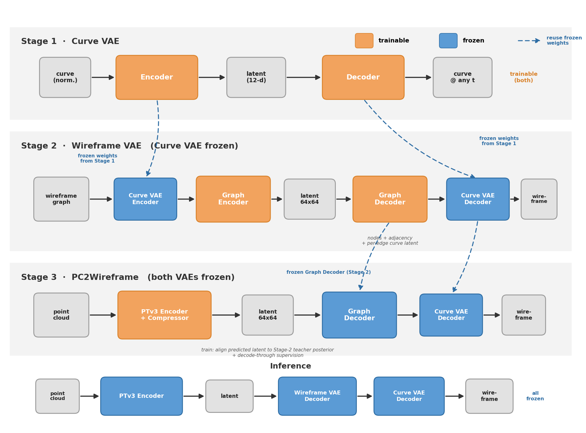
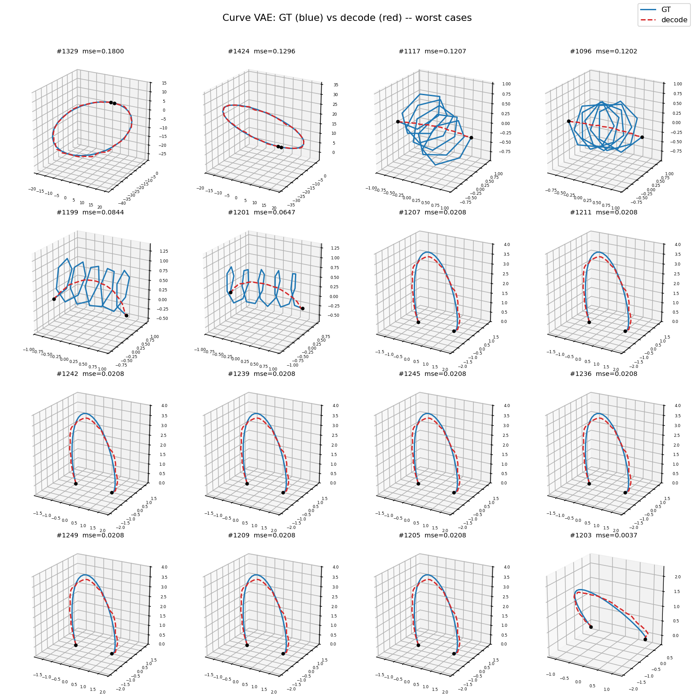

# CAD Wireframe 神经压缩挑战赛

 

比赛主页: https://mathmagic-official.github.io/AICAD/

数据集以及 Baseline: https://pan.ustc.edu.cn/share/index/8902361d3b5745f78245

## 框架概览

点云 → wireframe 的**三阶段**流水线，每个阶段独立训练、独立 config，前一阶段的权重冻结后喂给下一阶段：

| 阶段 | 模块 | 作用 | config |
| --- | --- | --- | --- |
| Stage 1 | **Curve VAE** (`AutoencoderKL1D`) | 把单条**规范化曲线**编码成 12 维 token latent，并可在任意参数 `t` 处解码 | `configs/curve_vae.yaml` |
| Stage 2 | **Wireframe VAE** (`AutoencoderKLWireframe`) | 把 wireframe 当作**属性图**（节点=端点坐标，边=曲线 latent）编码成定长 `64×64` latent，再解码出"节点集 + 邻接 + 逐边曲线 latent"；曲线形状用**冻结的 Stage-1 Curve VAE** 编码 | `configs/wireframe_vae.yaml` |
| Stage 3 | **PC2Wireframe** (PTv3 + Latent Compressor) | 点云预测 `64×64` latent，对齐 Stage-2 teacher posterior 并 decode-through 监督；**两个 VAE 全程冻结** | `configs/pc2wireframe.yaml` |

## Pipeline (AI生成)

## Curve VAE (50 Epoch)

## Wireframe VAE

把 wireframe 建模为**属性图** $G=(V,E)$：节点 $V$ 是端点（3D 坐标），边 $E$ 是曲线（携带冻结 Curve VAE 的 12 维 latent + 两端点引用）。相比把图序列化成脆弱的差分邻接 `(col_diff, row_diff)`、且每条边各自回归端点的旧做法，新架构原生地压缩 / 解码这张图：

- **Encoder**：节点 token（坐标傅里叶嵌入）+ 边 token（曲线 latent 注入两端点嵌入）先自注意力，再由 `64` 个可学 latent query cross-attn 汇聚成高斯后验 `(B, 64, 64)`（保持 Stage-3 的 `64×64` 接口）。
- **Decoder**：latent 自注意力后，`max_nodes=768` 个 node query cross-attn，分三个头预测：① 逐节点 `(坐标, 存在概率)`（节点集，免数数）；② 节点 token 上的对称内积邻接（link prediction）；③ 由两端节点 token 预测逐边曲线 latent。
- **训练**：预测节点与 GT 顶点做**匈牙利匹配**（保证排列不变），再在匹配空间监督 `坐标 / 存在 / 邻接 / 曲线 latent`。端点因此**只解码一次、天然共享**，拓扑变成两两分类而非 cumsum 链。
- **边方向**：用坐标字典序确定每条边的规范朝向（编码曲线 latent 与重建 denorm 两端共用），消除曲线方向歧义。

数据 / 重建打包见 `src/models/packing.py`（`graph_to_node_inputs` / `reconstruct_graph`），模型见 `src/models/vae/vae_wireframe.py`。

### 重建效果 (100 Epoch)

TODO......

## PC2Wireframe (200 Epoch)

TODO......