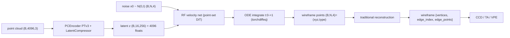

<div align="center">

# CAD Wireframe 神经压缩挑战赛 — Rectified Flow 分支

<a href="https://pytorch.org/get-started/locally/"></a>
<a href="https://pytorchlightning.ai/"></a>
<a href="https://hydra.cc/"></a>
<a href="https://github.com/ashleve/lightning-hydra-template"></a><br>

</div>

比赛主页: https://mathmagic-official.github.io/AICAD/

数据集以及 Baseline: https://pan.ustc.edu.cn/share/index/8902361d3b5745f78245

## 框架概览

`点云 -> PTv3 -> z(16×256=4096) -> Rectified Flow 去噪点集(xyz,type) -> 传统方法重建 wireframe`。
**单一可训练模型**(编码器 + RF 速度网络)、**单一 config**、**单阶段训练**:

| 模块 | 作用 |
| --- | --- |
| **PCEncoder** (`PTv3` + `LatentCompressor`) | 点云 `(B,4096,3)` → 确定性 latent `z (B,16,256)`(`variational=false`,`z=mu`,无 KL)。`16×256=4096` floats 正好是比赛 latent 预算上限。 |
| **RFPointSetVelocity** (点集 DiT) | 以 `z` 为条件的置换等变速度场:对 `8192` 个点做全局 self-attention + 对 16 个 latent token 的 cross-attention,时间步用正弦嵌入 + AdaLN-Zero 注入。注意力走 `scaled_dot_product_attention`(Flash / memory-efficient),`8192` 点自注意力显存 `O(N)` 而非 `O(N²)`,可选 gradient checkpointing。 |
| **传统重建** (`src/recon/traditional.py`) | RF 采样出的点集 `(N,4)` → wireframe:顶点 = 对 `type≈1` 的点做半径合并聚类;边 = "最近两顶点投票";边曲线 = 其支撑点按投影排序后重采样。纯确定性,无学习。 |



## 目标点集 (RF target)

每个样本产出固定尺寸的目标点集 `wf_points (N=8192, 4)`,每点 `(x, y, z, type)`,`type` 是一个连续通道
(顶点≈1 / 边≈0,推理时按 `0.5` 阈值二分)。类型**不预留固定配比**,由数据决定、由 RF 涌现:

- 全部 GT 顶点 → `type=1`(顶点数 `V > N` 的极端原始样本对顶点做下采样);
- 其余 `N - V` 个点 → 对所有边折线做**全局弧长采样**,`type=0`。

本分支用**原始(未清洗)数据**(`train/sample_edge` + `data/split.json`),并**取消** `max_vertices/max_edges`
超界跳过(设为 `0`/不限)——固定尺寸的弧长目标天然吸收稠密样本,无需清洗。

## 训练

依赖:除点云栈外,RF 分支还需 [`torchcfm`](https://github.com/atong01/conditional-flow-matching)
(`ConditionalFlowMatcher`)与 [`torchdiffeq`](https://github.com/rtqichen/torchdiffeq)(`odeint`)。

训练即 1-rectified flow:`x1=wf_points`、`x0~N(0,I)`,TorchCFM `ConditionalFlowMatcher(sigma=0)` 给出
`(t, xt, ut)`,网络回归速度 `v=net(t,xt,z)`,损失为 `MSE(v, ut)`。验证用固定噪声种子做确定性 ODE 采样,
再走传统重建并计算 `val/{score,ccd,ta,vpe}`。

```bash
# 单 GPU
python -m src.main fit --config configs/data.yaml --config configs/rf.yaml
# 也可以： bash scripts/run.sh train

# 8x A800 DDP
python -m src.main fit --config configs/data.yaml --config configs/rf_ddp.yaml
# 也可以： bash scripts/run.sh train_ddp
```

显存/速度杠杆:`rf_net.{depth,d_model,nhead}`、`data.batch_size`、`wf_num_points (N)`、`rf_net.grad_checkpoint`。

## 推理 / 提交

```bash
python -m src.main predict --config configs/data.yaml --config configs/rf.yaml \
    --ckpt_path <rf.ckpt>
# 也可以： CKPT=<rf.ckpt> bash scripts/run.sh predict
```

预测在每形状的归一化坐标系下进行,再用 `pc_center` / `pc_scale` 映射回原始 CAD 坐标。

## 数据清洗(可选工具)

RF 分支默认直接吃原始数据,但仓库仍保留 `scripts/clean_wireframe.py` 作为独立工具(按几何焊接重复顶点 /
删退化边 / 溶解光滑链 / 拆螺旋线)。若想在清洗后的数据上训练,把 `configs/data.yaml` 的
`train_edge_subdir` 指向清洗输出目录、并改用独立的 split 文件即可。

```bash
# 随机洗几个 + 前后对比可视化（也可 --pick worst / --files 指定）
python scripts/clean_wireframe.py test --num 6 --pick random --viz-out logs/clean_preview.png

# 全量清洗（多进程），结果写到 --out-dir，并生成 _clean_report.json 前后分位数对比
python scripts/clean_wireframe.py all \
    --in-dir data/train/sample_edge --out-dir data/train_clean/sample_edge --workers 16
```
