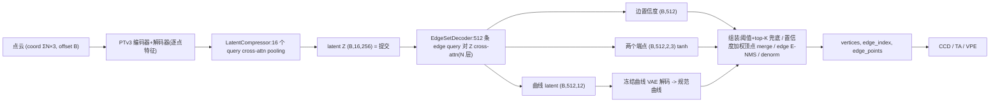

<div align="center">

# CAD Wireframe 神经压缩挑战赛 — PTv3 + Edge-Query DETR 分支

<a href="https://pytorch.org/get-started/locally/"></a>
<a href="https://pytorchlightning.ai/"></a>
<a href="https://github.com/ashleve/lightning-hydra-template"></a><br>

</div>

比赛主页: https://mathmagic-official.github.io/AICAD/

数据集以及 Baseline: https://pan.ustc.edu.cn/share/index/8902361d3b5745f78245

## 框架概览

`点云 -> PTv3 编码器+解码器 -> LatentCompressor(16×256) -> latent Z -> EdgeSetDecoder(512 条 edge query) -> 每条边(置信度 + 两端点 + 12 维曲线 latent) -> 冻结曲线 VAE 解码 -> 顶点 merge 重建 -> wireframe`。

整条流水线是 **WireframeDETR / PBWR 风格的 edge-set 回归**(直接预测一组边并做匈牙利匹配),分**两个独立阶段**训练:

1. **阶段 1 — 曲线 VAE**(`CurveVAEModule`):在规范化后的 GT 曲线上单独训练逐曲线 VAE(`AutoencoderKL1D`,端点钉在 `[-1,0,0]`/`[1,0,0]`,`3 通道 × 4 latent_len = 12 维` latent)。
2. **阶段 2 — 点云 → wireframe**(`PC2WireframeModule`):PTv3 编码器 + LatentCompressor + EdgeSetDecoder **联合训练**,曲线 VAE 从阶段 1 **冻结**加载,只负责把每条边的 12 维 latent 解成曲线。

提交内容是 PTv3 latent 的 **16×256 = 4096 个 float32**(不再是 RVQ 索引)。



| 模块 | 作用 |
| --- | --- |
| **PCEncoder**(`PointTransformerV3` + `LatentCompressor`) | **原始变长点云**(打包成 `coord (ΣN,3)` + `offset (B,)`)→ PTv3 编码器+解码器(`cls_mode=false`,得到逐点/逐体素特征)→ 按 batch 分组补齐 → `LatentCompressor` 用 `16` 个可学习 query 做 cross-attn pooling + 若干层 refine → 输出固定长度 latent 分布 `(mu, logvar)`,形状 `(B,16,256)`(`16×256=4096` 顶满比赛预算)。`variational=true` 时走 VAE(reparam + KL)。详见 `src/models/pc_encoder.py`、`src/models/latent_compressor.py`、`src/models/ptv3/`。 |
| **EdgeSetDecoder**(edge-query DETR 解码器) | 仅从 `16×256` latent 重建一组边。latent 投影到 `d_model` 并加可学习位置编码作为 cross-attn **memory**;`512` 条**边 query** 经 `N` 个 pre-norm 解码层(self-attn + 对 memory 的 cross-attn + FFN)。三个 head:**置信度** `(Ne,)`、**两个端点** `(Ne,2,3)`(`tanh` 压进 `[-1,1]`)、**12 维曲线 latent** `(Ne,12)`。可选**深监督**:每个中间层都出一套预测。详见 `src/models/edge_set_decoder.py`。 |
| **曲线 VAE**(`AutoencoderKL1D`,冻结) | 纯 PyTorch 的注意力/token 逐曲线 VAE:`encode` 把规范曲线压成小 token latent,`decode(z,t)` 在任意参数 `t` 处解码(端点钉在 `[-1,0,0]`/`[1,0,0]`)。阶段 1 单独训练,阶段 2 经 `curve_vae_ckpt` **冻结**加载。详见 `src/models/vae/`。 |
| **EdgeSetCriterion**(匈牙利 edge-set 匹配) | 每 shape 把 512 条 query 与 GT 边匈牙利匹配:代价 = 端点 L1(两种端点定向取小)+ 存在性 + 曲线 latent L1(对 GT 规范曲线的 stop-grad 后验均值)。损失 = 存在性 focal/BCE(匹配=正,其余=背景)+ 匹配边端点 L1 + 经冻结曲线 VAE 的曲线损失(L1 + 端点)+ 小的 latent 正则。深监督复用末层匹配。详见 `src/models/edge_set_criterion.py`。 |
| **顶点 merge 重建**(`assemble_wireframe`) | 保留 `sigmoid(置信度)≥ethr` 的边(不足时 top-K 兜底 `min_edges`);按字典序给每条边定向;收集端点做 **置信度加权的迭代 merge**(`merge_tol` 内最近端点对合并、合并点取加权质心,**绝不**合并同一条边的两端);去自环;用 **edge E-NMS**(端点共享后按中点距离 + 长度比抑制近重复)合并平行弧(每对顶点至多保留 2 条);可选**悬浮边清理** `prune_dangling`;最后 `denorm_curves` 把规范曲线锚到 merge 后的端点并重编号。详见 `src/recon/edge_wireframe.py`。 |

## 目标 / 监督 (target)

每个样本保留**原生 GT wireframe 图**:顶点 + `edge_index` + 每条边的有序采样点 `edge_points (E,P,3)`(其首/尾点即两端顶点)。阶段 2 的监督是 edge-set:每条 GT 边提供**两端点**(按字典序定向)与**规范曲线**。

坐标**全程保持原始**(数据集已归一化到 `[-1, 1]`)。点云若少于 `min_pc_points=100` 个点,或边数 `> max_edges=512`(loop / complex 拆分后)该样本会被**跳过**。

**数据清洗与拆分**(`src/data/dataset.py`):

- **闭合环拆分**:端点近重合但弧长 ≫ 弦长的闭合边在最远点拆成两条开弧(插入一个中点顶点),否则端点锚定的曲线坐标系无定义。
- **复杂边递归拆分**(需求 1):弧长/弦长 `> complex_ratio` 的边(大圆弧 / 螺旋 / 多缠绕样条)单个 12 维 latent 难以表达,在折线相对弦的最大偏离点处**递归拆分**并插入新顶点,直到每段足够简单或达到 `complex_max_depth`;每段重采样到 `num_edge_points`。配置见 `configs/data.yaml` 的 `split_complex` / `complex_ratio` / `complex_max_depth` / `complex_min_arc`。

## 损失(edge-set 匈牙利匹配)

逐 shape、顺序无关的匈牙利匹配(`scipy.optimize.linear_sum_assignment`),细节见 `EdgeSetCriterion`:

- **匹配代价**:`match_endpoint·端点L1(定向取小) + match_lat·‖curve_latent − sg(μ)‖₁ − match_exist·sigmoid(置信度)`;`μ` 是 GT 规范曲线经冻结曲线 VAE 的后验均值(stop-grad,只当匹配/正则用)。
- **存在性损失**:对**全部** 512 条 query 的 focal(`focal_gamma>0`)或标定 BCE(匹配=1,其余=背景)——这是抑制"过预测"、让多余 query 留空的关键(见下文)。
- **端点 L1**:匹配边上,两种端点定向取小。
- **曲线损失**:匹配边的 `curve_latent` 经**冻结**曲线 VAE 解码,与固定 GT 规范曲线在规范坐标系比较(L1 + 端点 L1)。
- **latent 正则**:很小权重的 `L2(curve_latent, sg(μ))` 保持预测 latent 在曲线 VAE 流形上。
- **深监督**:每个中间解码层复用末层匹配再算一遍上述损失,按 `aux_weight` 累加。

阶段 2 还在 PTv3 latent 上加一个小 KL(`kl_weight`,仅 `variational` 时)。验证时在 `(ethr, merge_tol)` 网格上重算分数,checkpoint 按其中最优的 `val/score_best`(越大越好)选优,并记录最优阈值 `val/best_{ethr,merge_tol}`,另记可观测性指标(`recon/nonempty_frac`、`recon/pred_edges` vs `recon/gt_edges` 等)。

### 为什么保留置信度头(需求 8)

512 条 query 远多于真实边,匈牙利匹配会把大部分 query 分给"背景"。若没有置信度/存在性目标,未匹配的 query 没有梯度把它们推离真实几何,会漂到真实边附近输出看似合理的端点;顶点 merge 只能合并**端点重合**的边,无法删除整条幻觉边。因此保留置信度头 + 验证时扫阈值 + 空输出 top-K 兜底,是控制 precision/recall 的唯一手段。

## 训练

依赖见 `requirements.txt`:点云栈(PTv3 需 `spconv` / `flash-attn` / `torch_scatter` / `timm`)、`pytorch_lightning` / `torchmetrics`、`pytorch3d`(KNN chamfer)、`scipy`(匈牙利匹配)、`einops`(曲线 VAE)。**不再依赖 `vector-quantize-pytorch` 或 Utonia 预训练权重**。

```bash
# 阶段 1:曲线 VAE(100 epoch)
python -m src.main fit --config configs/data.yaml --config configs/curve_vae.yaml
# 也可以： bash scripts/run.sh stage1   # DDP: bash scripts/run.sh stage1_ddp

# 阶段 2:点云 -> wireframe(300 epoch,冻结曲线 VAE)
python -m src.main fit --config configs/data.yaml --config configs/pc2wireframe.yaml \
    --model.curve_vae_ckpt <阶段1 最优 ckpt>
# 也可以： CURVE_VAE_CKPT=<阶段1 ckpt> bash scripts/run.sh stage2   # DDP: stage2_ddp
```

`curve_vae.yaml` / `pc2wireframe.yaml`(单 GPU)与其 `_ddp` 孪生(8x A800)是**同一个模型**,只有 `trainer.devices`/`strategy` 与 `lr`(多卡全局 batch 大 8 倍,LR ~√8 放大)不同。**阶段 2 的 `curve_vae` 配置必须与阶段 1 完全一致**。

显存/速度杠杆:`pc_encoder.{enc,dec}_*`、`decoder.{num_edge_queries,num_layers,d_model}`、`curve_vae.*`、`data.batch_size`。

评测/调试脚本:

```bash
python scripts/eval_curve_vae.py --ckpt <阶段1 ckpt>             # 阶段 1 重建可视化
python scripts/eval_pc2wireframe.py --ckpt <阶段2 ckpt>          # 阶段 2 val 指标 + 图
python scripts/clean_wireframe.py test --num 6 --pick worst     # GT 清洗预览
```

## 推理 / 提交

提交导出是**单次前向**(encode → `16×256` latent Z → EdgeSetDecoder → 冻结曲线 VAE 解码 → 顶点 merge 重建)。每个样本的 `latent` 字段即**扁平 4096 个 float32**(`Z.reshape(-1)`)。`--ethr` / `--merge-tol` 可覆盖 ckpt 内置阈值。

```bash
# 单 GPU
python scripts/export_submission.py --ckpt <pc2wireframe.ckpt 目录或文件> --out-dir logs/submission
# 也可以： CKPT=<pc2wireframe.ckpt> bash scripts/run.sh export_submission

# 8-GPU 数据并行(每 GPU 一个 worker,自动合并 + 打包 submission.zip)
python scripts/export_submission.py --spawn 8 --ckpt <pc2wireframe.ckpt> --out-dir logs/submission

# 断点续跑
python scripts/export_submission.py --spawn 8 --ckpt <pc2wireframe.ckpt> --out-dir logs/submission --resume
```

提交布局:

```text
submission/
    latent_pack.npz                 # stems (N,) + latents (N, 4096) float
    sample_edge/<stem>.npz
        latent       : (4096,) float32   # 扁平 16x256 PTv3 latent
        vertices     : (V, 3) float32
        edge_index   : (E, 2) int32
        edge_points  : (E, 32, 3) float32
        num_vertices : () int32
        num_edges    : () int32
```

## 可视化

```bash
# 把导出的 submission 与输入点云并排渲染(input | 预测 wireframe | overlay)
python scripts/visualize_submission.py \
    --sub-dir logs/submission/submission \
    --test-pc-dir data/test/sample_pointcloud --num 6 --out-dir logs/submission/viz
```

`scripts/make_split.py` 生成 `data/split.json`;`scripts/render_wireframe.py` 用于把单个 wireframe npz 渲染成图。

## 后续工作(merge / 拓扑,需求 9)

当前 `assemble_wireframe` 实现了:置信度加权的迭代顶点 merge、edge E-NMS 去重、可选悬浮边清理。更强的**全局拓扑优化(ComplexGen 式 ILP**,在流形性/环闭合等结构约束下最大化置信度)价值高但较重,列为未来工作。
