<div align="center">

# CAD Wireframe 神经压缩挑战赛 — VQVAE 分支

<a href="https://pytorch.org/get-started/locally/"></a>
<a href="https://pytorchlightning.ai/"></a>
<a href="https://github.com/ashleve/lightning-hydra-template"></a><br>

</div>

比赛主页: https://mathmagic-official.github.io/AICAD/

数据集以及 Baseline: https://pan.ustc.edu.cn/share/index/8902361d3b5745f78245

## 框架概览

`点云 -> 冻结 Utonia PTv3(多尺度)-> 每尺度 compressor -> 每尺度 ResidualVQ -> 拼接索引(≤4096,提交)-> 图解码器 -> 参数化 wireframe`。

整条流水线是一个**端到端单阶段离散自编码器(VQVAE)**:编码器把原始点云压成**多尺度**的连续 token,每个尺度用独立的
残差向量量化器(ResidualVQ)离散成码本索引;**拼接后的扁平索引**(`Σ_s N_s·n_q ≤ 4096`)即比赛提交内容。
解码器**仅凭这些索引**(索引 → 码本 → `z_q` → 解码器)用顶点 query 集合预测 + GNN 关系推理 + kNN 边候选重建出结构化、
参数化的 wireframe(直线 / 圆弧 / Bezier)。没有 KL(latent 是离散确定性的)。

```mermaid
flowchart LR
  PC["原始点云 (coord ΣN×3, offset B)"] --> ENC["冻结 Utonia PTv3 (enc_mode, no_grad)"]
  ENC --> MS["取若干 enc stage 的逐体素特征(不上采样)"]
  MS --> COMP["每尺度 compressor:N_s 个 query cross-attn"]
  COMP --> Z["多尺度连续 token z_s (B,N_s,256)"]
  Z --> RVQ["每尺度 ResidualVQ(n_q 级)"]
  RVQ --> IDX["拼接扁平索引 (B, ΣN_s·n_q ≤4096) = 提交"]
  IDX --> ZQ["decode_indices:索引 -> 码本 -> z_q"]
  ZQ --> DEC["图解码器:512 顶点 query 对多尺度 z_q cross-attn"]
  DEC --> VH["逐 query:alive logit + xyz"]
  DEC --> GNN["GNN/图 transformer 关系推理"]
  GNN --> EH["kNN 边候选两两边头 -> exist + type(3) + params(q1,q2)"]
  VH --> WF["decode -> vertices, edge_index, edge_points"]
  EH --> WF
  WF --> MET["CCD / TA / VPE"]
```



| 模块 | 作用 |
| --- | --- |
| **UtoniaEncoder**(冻结 `Utonia PTv3` + 每尺度可训练 `LatentCompressor`) | **原始变长点云**(打包成 `coord (ΣN,3)` + `offset (B,)`)→ 体素去重 → 冻结的 [Utonia](https://huggingface.co/Pointcept/Utonia) 预训练 PTv3 编码器(`enc_mode`、`eval`+`no_grad`,确定性)→ 沿 `GridPooling` 的 `pooling_parent` 链取**若干 enc stage 的逐体素特征**(**不上采样**,每尺度保持其原生分辨率;通道 `enc_channels[stage]` 从 ckpt 配置读取)→ 每尺度一个 compressor 池化成 `z_s (B,N_s,256)`,输出多尺度 token 列表(细→粗)。backbone 冻结、只训 compressor。详见 `src/models/utonia_encoder.py`。 |
| **MultiScaleResidualVQ**(每尺度独立 `ResidualVQ`) | 每尺度用各自的残差 VQ(`n_q` 级)把连续 token 量化成索引;**拼接成扁平索引**(固定 layout:尺度→token→量化级),`总索引 = Σ_s N_s·n_q`,**构造时**校验 `≤4096`。`forward` 返回直通 `z_q`、扁平索引与 commitment loss;`decode_indices` 仅凭扁平索引重建出 `z_q`(保证 索引→wireframe 的 round-trip)。`eval` 模式自动冻结码本(EMA 关闭)。依赖 `vector-quantize-pytorch`(自行安装)。详见 `src/models/quantizer.py`。 |
| **WireframeGraphDecoder**(顶点 query 解码器 + GNN + kNN 边头) | 仅从多尺度 `z_q` 重建 wireframe。各尺度 `z_q` 投影到 `d_model` 并加上**尺度 embedding** 后 concat 成 memory;`512` 个**顶点 query** 通过 `nn.TransformerDecoder` cross-attn;**顶点头**逐 query 输出 `alive` logit + `xyz`;再做多轮**几何感知 GNN/图 transformer**(节点特征 + xyz embedding)关系推理;**边头**只在**预测 xyz 的 kNN 候选对**(训练时并入 GT 正边)上打分,输入 `[h_i, h_j, h_i*h_j, |h_i-h_j|, global]`,输出 `exist` + 曲线 `type`(3)+ 内部 anchor `q1,q2`。详见 `src/models/wireframe_graph_decoder.py`、`src/recon/wireframe.py`。 |

## 目标 / 监督 (target)

每个样本保留**原生 GT wireframe 图**(顶点 + `edge_index`),并为每条边附带逐边监督:

- `edge_type`:`0=line / 1=arc / 2=bezier`,按几何残差判定;
- `edge_params (E,2,3)`:曲线在弧长 `t=1/3`(`q1`)与 `t=2/3`(`q2`)处的坐标。

坐标**全程保持原始**(不归一化)。点云若为空、`max(|coord|) > 1.2`,或顶点数 `> max_vertices=512`(= 解码器 query 数上限),该样本会被**跳过**。

## 损失(DETR 风格集合预测 + VQ)

- **匈牙利匹配**:用 `scipy.optimize.linear_sum_assignment` 把 `512` 个顶点 query 与 GT 顶点按 **xyz L1** 代价匹配;
- `loss_vertex`:匹配上的顶点坐标 L1;
- `loss_alive`:顶点存活 BCE(匹配=正例,其余=负例;`alive_pos_weight=10` 上权重稀少正例);
- `loss_edge`:边存在 **focal loss**(`gamma=2, alpha=0.25`),候选 = GT 正边 ∪ 预测 xyz 的 kNN 负边(对齐推理的 kNN 解码);
- `loss_edge_type`:边曲线类型**类别加权** CE(权重 `[1,3,9]`);
- `loss_edge_param`:边 anchor `(q1,q2)` 的 L1;
- `loss_curve_geom`:按预测类型/参数采样曲线与 GT 曲线点的 Chamfer(权重 `0.2`);
- `loss_commit`:VQ commitment loss,经 `quant_warmup_steps`(先用连续 `z` 预热)后,权重 `0 → w_commit` 线性 ramp。

并按尺度记录码本 `perplexity`(`vq/perplexity_s*`)监控码本利用率/塌缩。验证时从 `z_q` 解码并计算 `val/{score,ccd,ta,vpe}`,checkpoint 按 `val/score` 选优(越大越好)。

## 训练

依赖:点云栈(Utonia PTv3 需 `spconv` / `flash-attn` / `torch_scatter` / `timm`)、`pytorch_lightning` / `torchmetrics`、`pytorch3d`(KNN chamfer)、`scipy`(匈牙利匹配),以及 **`vector-quantize-pytorch`**(VQVAE 量化器,**自行安装**:`pip install vector-quantize-pytorch`)。Utonia 权重默认从本地 `logs/utonia/utonia.pth` 加载(在 `configs/vqvae*.yaml` 的 `pc_encoder.utonia` 配置)。

```bash
# 单 GPU
python -m src.main fit --config configs/data.yaml --config configs/vqvae.yaml
# 也可以： bash scripts/run.sh train

# 8x A800 DDP
python -m src.main fit --config configs/data.yaml --config configs/vqvae_ddp.yaml
# 也可以： bash scripts/run.sh train_ddp
```

显存/速度杠杆:`pc_encoder.scale_tokens`(多尺度 token 分配)、`quantizer.{n_q,codebook_size}`、`decoder.{num_layers,gnn_rounds,knn_k,d_model}`、`data.batch_size`、`max_decode_vertices`。

## 推理 / 提交

提交导出是**单次前向**(encode → 多尺度 `z` → 每尺度 RVQ → 拼接索引),并在写出前用 `decode_indices` 从**提交的索引**还原 `z_q` 再解码(代码层面保证 round-trip 与 `budget ≤ 4096`)。每个样本的 `latent` 字段即扁平索引向量(float32)。

```bash
# 单 GPU
python scripts/export_submission.py --ckpt <vqvae.ckpt 目录或文件> --out-dir logs/submission
# 也可以： CKPT=<vqvae.ckpt> bash scripts/run.sh export_submission

# 8-GPU 数据并行(每 GPU 一个 worker,自动合并 + 打包 submission.zip)
python scripts/export_submission.py --spawn 8 --ckpt <vqvae.ckpt> --out-dir logs/submission

# 断点续跑
python scripts/export_submission.py --spawn 8 --ckpt <vqvae.ckpt> --out-dir logs/submission --resume
```

提交布局:

```text
submission/
    latent_pack.npz                 # stems (N,) + latents (N, K<=4096) 扁平索引
    sample_edge/<stem>.npz
        latent       : (K,) float32   # 拼接的 RVQ 索引(固定 layout)
        vertices     : (V, 3) float32
        edge_index   : (E, 2) int32
        edge_points  : (E, 32, 3) float32
        num_vertices : () int32
        num_edges    : () int32
```

## 可视化

```bash
# val：input point cloud | 预测 wireframe(+逐样本 score/ccd/ta/vpe) | GT wireframe
python scripts/vis_ae_val.py --ckpt <vqvae.ckpt> --split val --num 6

# test(无 GT)：额外画出 baseline submission 列对照
python scripts/vis_ae_val.py --ckpt <vqvae.ckpt> --split test --num 8 --out logs/ae_test.png
```

`scripts/make_split.py` 生成 `data/split.json`;`scripts/render_wireframe.py` 用于把单个 wireframe npz 渲染成图。

## 用户自行验证清单(代码已交付,以下由你执行)

1. 安装量化依赖:`pip install vector-quantize-pytorch`(以及既有点云栈 / pytorch3d)。
2. 单 GPU 小步训练:`python -m src.main fit --config configs/data.yaml --config configs/vqvae.yaml`,观察 `train/loss`、各尺度 `vq/perplexity_s*` 是否健康(无大面积死码)、是否过早 NaN;`commit` 权重应在 `quant_warmup_steps` 后从 0 ramp 起。
3. 一次导出:`python scripts/export_submission.py --ckpt <ckpt> --out-dir logs/submission`,确认每样本提交 `latent.size ≤ 4096`、`latent_pack` 宽度一致、`val/score` 可出数(索引→`z_q`→wireframe round-trip 正常)。
4. 按需消融:`decoder.{gnn_rounds,knn_k}`、`pc_encoder.scale_tokens`、`quantizer.n_q`、`codebook_size`。
5. 解冻 backbone(把 `pc_encoder.freeze: false`)作为后续表示能力杠杆。
