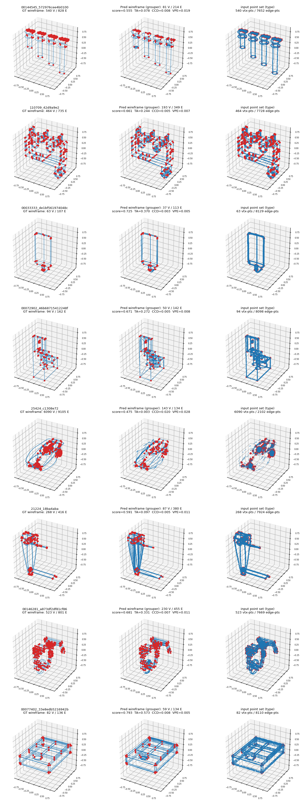

<div align="center">

# CAD Wireframe 神经压缩挑战赛 — Rectified Flow 分支

<a href="https://pytorch.org/get-started/locally/"></a>
<a href="https://pytorchlightning.ai/"></a>
<a href="https://hydra.cc/"></a>
<a href="https://github.com/ashleve/lightning-hydra-template"></a><br>

</div>

比赛主页: https://mathmagic-official.github.io/AICAD/

数据集以及 Baseline: https://pan.ustc.edu.cn/share/index/8902361d3b5745f78245

## 框架概览

`点云 -> 冻结 Utonia PTv3 + 可训练 compressor -> z(64×64=4096) -> Rectified Flow 解码 anchor 点集(纯 xyz) -> Wireframe Grouper 解析出参数化 wireframe`。
两个**独立训练**的阶段拼成完整流水线:**Stage 1** 把点云压成 latent,再用 rectified flow 解码出一个固定尺寸的
**纯 xyz** anchor 点集(每个点都是落在 wireframe 上的几何点,不再带 type 通道);**Stage 2** 用一个学习式 grouper
(点 Transformer)把这堆带噪 anchor 点回归成逐点场,再解析成结构化、**参数化**的 wireframe 图(直线 / 圆弧 /
Bezier),取代脆弱的手写规则重建。


| 模块 | 阶段 | 作用 |
| --- | --- | --- |
| **UtoniaEncoder** (冻结 `Utonia PTv3` + 可训练 `LatentCompressor`) | Stage 1 | **原始变长点云**(打包成 `coord (ΣN,3)` + `offset (B,)`,PTv3 原生格式) → 体素去重(每体素留一点,对齐 Utonia 的 GridSample 推理) → 冻结的 [Utonia](https://huggingface.co/Pointcept/Utonia) 预训练 PTv3 编码器(`eval` + `no_grad`,确定性)出粗粒度逐体素特征 → 可训练 compressor 池化成 latent `z (B,64,64)`。`64×64=4096` floats 正好是比赛 latent 预算上限。backbone 冻结、只训 compressor。 |
| **RFPointSetVelocity** (点集 DiT) | Stage 1 | 以 `z` 为条件的置换等变速度场,输出 **3 通道** xyz 速度:对 `8192` 个点做全局 self-attention + 对 64 个 latent token 的 cross-attention,时间步用正弦嵌入 + AdaLN-Zero 注入。注意力走 `scaled_dot_product_attention`(Flash / memory-efficient),`8192` 点自注意力显存 `O(N)` 而非 `O(N²)`,可选 gradient checkpointing。 |
| **WireframeGrouper** (点 Transformer) | Stage 2 | 学习式重建,取代手写规则。对每个 anchor 点回归 5 组场:`endpoint_offset (2,3)`(双 Hough 投票出两个端点顶点)、`embedding (D)`(实例 embedding,同边相近异边相远)、`curve_type (3)`(line/arc/bezier logits)、`anchor (2,3)`(曲线 t=1/3、t=2/3 坐标)、`arclen (1)`(沿边归一化弧长,辅助)。解码即:把所有端点投票聚类成顶点 → 把每条边的两个端点 snap 到顶点恢复 `edge_index` → 用 embedding 切分共端点的边 → 按 `curve_type` 把 `(a,q1,q2,b)` 参数化采样成曲线。详见 `src/models/wireframe_grouper.py`、`src/recon/grouped.py`。 |
| **传统重建** (`src/recon/traditional.py`) | (legacy) | 早期 `(N,4)=(xyz,type)` 点集 → wireframe 的纯确定性 baseline(顶点 = 对 `type≈1` 的点半径合并;边 = 最近两顶点投票)。现已被纯 xyz anchor + grouper 取代,仅作历史对照保留,**不在当前流水线上**。 |

```mermaid
flowchart LR
  subgraph S1["Stage 1 — Rectified Flow"]
    PC["raw point cloud (coord ΣN×3, offset B)"] --> ENC["frozen Utonia PTv3 + trainable compressor"]
    ENC --> Z["latent z (B,64,64) = 4096 floats"]
    X0["noise x0 ~ N(0,I) (B,N,3)"] -->|per-sample OT coupling| VEL
    Z --> VEL["RF velocity net (point-set DiT)"]
    VEL --> ODE["ODE integrate t:0->1 (torchdiffeq, 50 steps)"]
    ODE --> WP["anchor point set (B,N,3)=xyz"]
  end
  subgraph S2["Stage 2 — Wireframe Grouper"]
    WP --> GRP["WireframeGrouper (point transformer)"]
    GRP --> HEADS["per-point: endpoint_off / anchor / curve_type / embedding / arclen"]
    HEADS --> DEC["group & decode (cluster endpoints + snap + split + parse curve)"]
  end
  DEC --> WF["wireframe {vertices, edge_index, edge_points}"]
  WF --> MET["CCD / TA / VPE"]
```



## 目标点集 (target)

每个样本产出固定尺寸的目标点集 `wf_points (N=8192, 3)`,每点是落在 wireframe 上的 `(x, y, z)` anchor 点 ——
**纯几何,不带 type 通道**。采样按弧长进行:先保证每条边至少 `min_pts_per_edge` 个点,剩余预算再按**全局弧长**
铺满所有边,这样短边不会被长边吃掉。

- **Stage 1** 只需要这 `(N,3)` 点集本身作为 rectified-flow 的 `x1`。
- **Stage 2** 在同一套采样上**额外**保留逐点标签(`collate_grouper_batch` 透传):所属 `edge_id`、沿边弧长
  `arclen`、两个端点 `endpoint_a/b`、曲线类型 `curve_type`(由 `_fit_curve_type` 按几何残差判 line/arc/bezier)、
  以及两个 anchor `anchor1/2`(边曲线 t=1/3、t=2/3 坐标);同时保留原生 GT 图供 topo / geom 监督。

本分支用**原始(未清洗)数据**(`train/sample_edge` + `data/split.json`),两个阶段共用同一套加载/过滤逻辑
(`WireframePointDataset` 继承自 `WireframeGraphDataset` 只覆写 `_make_item`):坏文件跳过、`ne < min_edges`
跳过、`nv > max_vertices` 或 `ne > max_edges` 的病态超大 wireframe 丢弃、空点云跳过。两阶段的过滤阈值现已统一
为 `max_vertices = max_edges = 1024`,保证 Stage 2 与 Stage 1 训练在同一尺寸分布上(否则 8192 点摊到过多边时每边
点数过少)。

## 训练

两个阶段各自独立训练(不共享权重、不端到端联合)。

### Stage 1 — Rectified Flow

依赖:除点云栈(Utonia PTv3 需 `spconv` / `flash-attn` / `torch_scatter` / `timm`)外,RF 分支还需
[`torchcfm`](https://github.com/atong01/conditional-flow-matching)(`ConditionalFlowMatcher`)
与 [`torchdiffeq`](https://github.com/rtqichen/torchdiffeq)(`odeint`)。Utonia 权重默认从本地
`logs/utonia/utonia.pth` 加载(在 `configs/rf*.yaml` 的 `pc_encoder.utonia` 配置;也可填 HF 名 `utonia` +
`utonia_repo_id: Pointcept/Utonia` 走自动下载)。

训练是 **1-rectified flow + 逐样本最优传输(OT)耦合**:`x1=wf_points (N,3)`、`x0~N(0,I)`,在**每个样本内部**用
熵正则 Sinkhorn(`ot_couple_noise`,平方欧氏 cost、log 域稳定)把 `N` 个噪声点重排到与 `N` 个目标点对齐,再用
`ConditionalFlowMatcher(sigma=0)` 给出 `(t, xt, ut)`,网络出速度 `v=net(t,xt,z)`。

> **为什么必须 OT(与是否带 type 无关)**:目标是置换不变点集,随机/独立配对会让逐点速度目标 `ut=x1-x0` 自相
> 矛盾,其 Bayes 最优回归塌成把噪声往数据质心收缩的均值场(模型退化成一团 blob)。OT 把每个目标点配到附近的噪声点,
> 才让速度可学。耦合在 `no_grad` 下只选 `(x0,x1)` 配对,不回传梯度。

三个 xyz 通道统一回归速度 `ut`(训练与速度积分采样器共用同一套参数化),损失就是单一 MSE:
`loss = w_xyz · MSE(v, ut)`。

验证**只算 flow-matching 的 `val/loss`**(不做 ODE 采样 / 重建 / 打分,那是 Stage 2 的事),checkpoint 直接按它选;
`predict_step` 用固定噪声种子做确定性 ODE 采样(`ode_steps=50` euler)输出 `(B,N,3)` 点集喂给 Stage 2。

```bash
# 单 GPU
python -m src.main fit --config configs/data.yaml --config configs/rf.yaml
# 也可以： bash scripts/run.sh train

# 8x A800 DDP
python -m src.main fit --config configs/data.yaml --config configs/rf_ddp.yaml
# 也可以： bash scripts/run.sh train_ddp
```

显存/速度杠杆:`rf_net.{depth,d_model,nhead}`、`data.batch_size`、`wf_num_points (N)`、`rf_net.grad_checkpoint`。

### Stage 2 — Wireframe Grouper

Grouper 不接触点云编码器:它**直接在 GT anchor 点集上训练**,并对输入 `jitter_std` 抖动 xyz 来模拟 Stage 1 输出的
带噪点集。监督**全程 teacher-forced**,损失由 7 项加权而成:

- `loss_endpoint` / `loss_anchor`:端点 `(a,b)` 与 anchor `(q1,q2)` 的 order-invariant smooth-L1(端点对正反向取小,
  anchor 跟随同一朝向);
- `loss_curve_type`:逐点 line/arc/bezier 的**类别加权** CE(权重 `[1,3,9]`,直线占多数、bezier 最稀有);
- `loss_arclen`:沿边弧长 MSE;
- `loss_embed`:判别式实例 embedding(De Brabandere et al. 2017,同边拉近异边推远);
- `loss_topo`:把每个端点投票按 `-dist/τ` softmax 到 GT 顶点集上,对边的两个真实顶点 id 做(顺序无关)CE;
- `loss_curve_geom`:按 GT 边聚合预测的 `(a,q1,q2,b)`、按预测类型参数化采样后与 GT 曲线点的 Chamfer(权重小)。

验证时做 group & decode(端点投票聚类成顶点 → snap 恢复 `edge_index` → embedding 切分 → 按类型参数化采样曲线)
并计算同一套 `val/{score,ccd,ta,vpe}`,与传统重建直接可比。

```bash
# 单 GPU
python -m src.main fit --config configs/grouper_data.yaml --config configs/grouper.yaml
# 也可以： bash scripts/run.sh train_grouper

# 8x A800 DDP
python -m src.main fit --config configs/grouper_data.yaml --config configs/grouper_ddp.yaml
# 也可以： bash scripts/run.sh train_grouper_ddp
```

下图为 grouper 验证集重建示例(左:GT wireframe;中:grouper 预测 + 逐样本 `score/ccd/ta/vpe`;右:输入带噪点集):



## 推理 / 提交

```bash
python -m src.main predict --config configs/data.yaml --config configs/rf.yaml \
    --ckpt_path <rf.ckpt>
# 也可以： CKPT=<rf.ckpt> bash scripts/run.sh predict
```

预测在每形状的归一化坐标系下进行,再用 `pc_center` / `pc_scale` 映射回原始 CAD 坐标。

## 数据清洗(可选工具)

RF 分支默认直接吃原始数据,但仓库仍保留 `scripts/clean_wireframe.py` 作为独立工具(按几何焊接重复顶点 /
删退化边 / 溶解光滑链 / 拆螺旋线)。若想在清洗后的数据上训练,把 `configs/data.yaml` 的
`train_edge_subdir` 指向清洗输出目录、并改用独立的 split 文件即可。

```bash
# 随机洗几个 + 前后对比可视化（也可 --pick worst / --files 指定）
python scripts/clean_wireframe.py test --num 6 --pick random --viz-out logs/clean_preview.png

# 全量清洗（多进程），结果写到 --out-dir，并生成 _clean_report.json 前后分位数对比
python scripts/clean_wireframe.py all \
    --in-dir data/train/sample_edge --out-dir data/train_clean/sample_edge --workers 16
```
