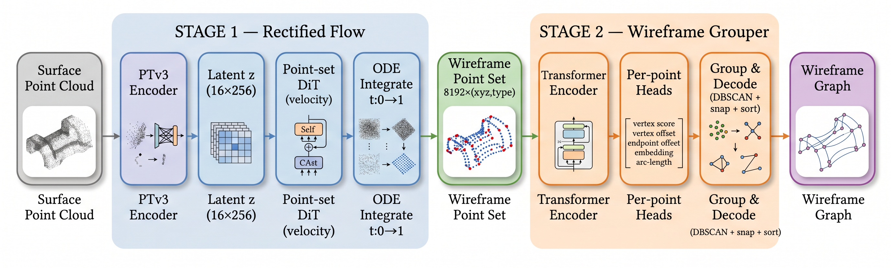
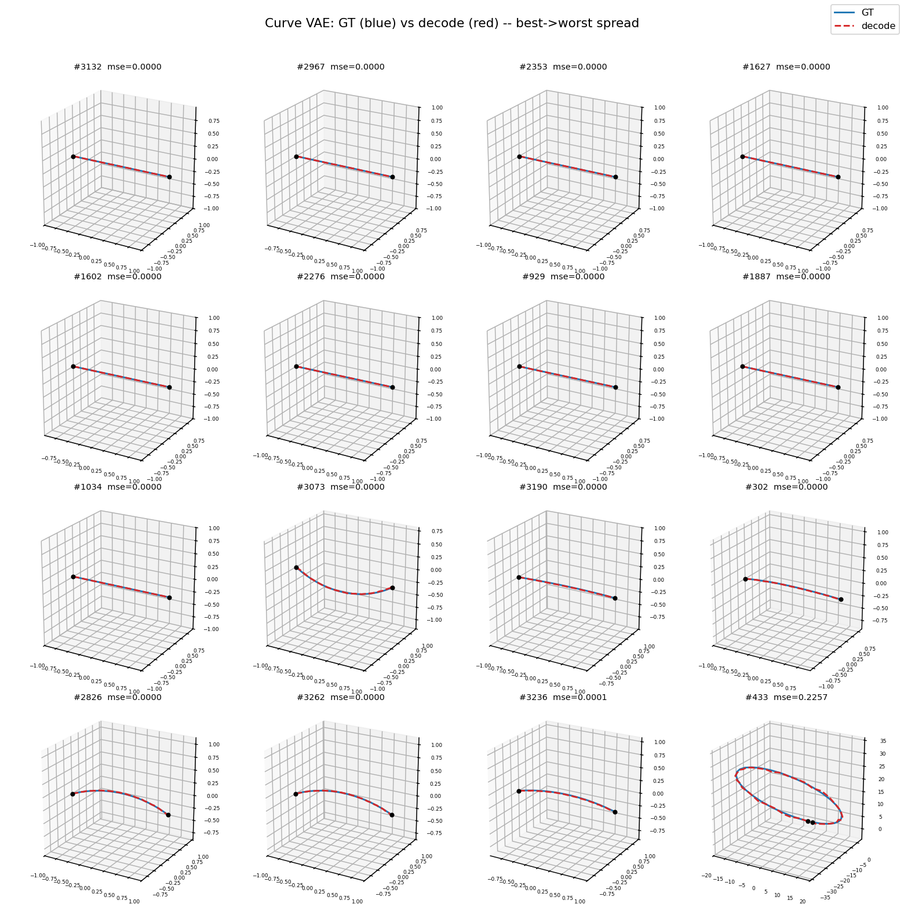
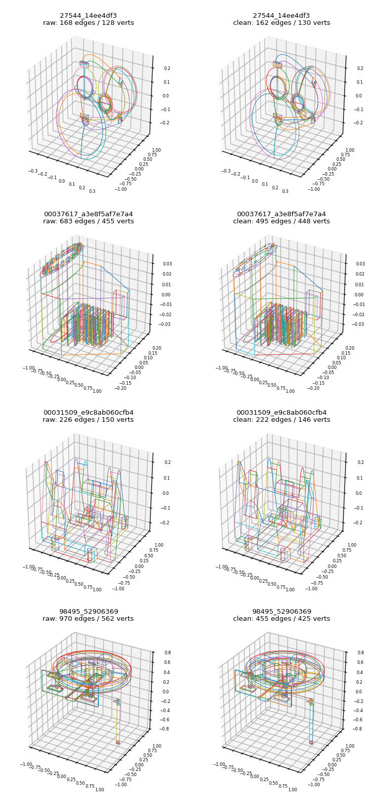

<div align="center">

# CAD Wireframe 神经压缩挑战赛 (已弃置，见RF分支)

<a href="https://pytorch.org/get-started/locally/"></a>
<a href="https://pytorchlightning.ai/"></a>
<a href="https://hydra.cc/"></a>
<a href="https://github.com/ashleve/lightning-hydra-template"></a><br>

</div>

比赛主页: https://mathmagic-official.github.io/AICAD/

数据集以及 Baseline: https://pan.ustc.edu.cn/share/index/8902361d3b5745f78245

## 框架概览

点云 → wireframe 的**两阶段**流水线，每个阶段独立训练、独立 config，第一阶段的权重冻结后喂给第二阶段：

| 阶段 | 模块 | 作用 | config |
| --- | --- | --- | --- |
| Stage 1 | **Curve VAE** (`AutoencoderKL1D`) | 把单条**规范化曲线**编码成 12 维 token latent，并可在任意参数 `t` 处解码 | `configs/curve_vae.yaml` |
| Stage 2 | **PC2Wireframe** (PTv3 + Latent Compressor + Transformer Decoder) | 点云直接预测 wireframe：PTv3 提特征 → cross-attn 压缩成 `16×256` latent → Transformer 解码器并行预测节点集 + 边集（含曲线 latent）；**Curve VAE 全程冻结**，仅用来解码曲线 | `configs/pc2wireframe.yaml` |

`16 × 256 = 4096` floats，正好是比赛的 latent 预算上限。

## Pipeline (AI生成)




## Curve VAE (50 Epoch)



## PC2Wireframe

端到端地把点云解码成 wireframe，**不再有独立的 wireframe VAE / teacher posterior**——直接对预测出的图做集合监督。参考官方基线，但把"候选对 + 贪心匹配"换成了 DETR 风格的**学习查询 + 全局匈牙利匹配**：

- **编码**：PTv3 backbone 提取逐体素点云特征；`16` 个可学 query 先通过 cross-attention 把它们汇聚成 16 个 token，再经 **2 层标准 Transformer decoder**（token 间 self-attn + cross-attn 回 PTv3 特征 + FFN，Perceiver 式）细化，最后投影成 `(B, 16, 256)` 的高斯后验 latent（保留小 KL 正则，提交时用 `mu`）。
- **解码器**：隐变量 token 投影后作为 cross-attention 的 **memory**。
  - **节点**：`num_node_queries=512` 个学习查询并行 cross-attend 到 memory，两个头分别预测每个节点的**坐标**与**存在置信度**（免数数的节点集）；坐标走 **Deformable-DETR 式迭代细化**——每层在 inverse-sigmoid 空间对参考点叠加一个 delta，逐层逼近而非末层一次回归。
  - **边**：`num_edge_queries=1024` 个边查询先 self-attn，再 cross-attend 到 latent memory，最后 cross-attend 到**节点特征**；预测每条边的**存在性**、两个**端点分布**（指针式 `edge_q · node_k` 在节点查询上的 softmax）以及一个**逐边曲线 latent**。
  - **曲线**：边查询输出的曲线 latent 喂给**冻结的 Stage-1 Curve VAE**，在端点线性插值基线上解码出残差折线（规范帧），推理时再 denorm 到预测端点上。
- **训练（集合预测）**：先用**匈牙利匹配**把节点查询对齐到 GT 顶点（坐标 L1 代价），再以该匹配为基准把边查询对齐到 GT 边（存在性 + 端点 log 概率代价）。在匹配空间监督：
  - 节点坐标 **L1** + 节点存在 **加权 BCE**；
  - 边存在性 **Focal BCE**（处理边的正负样本极端不平衡）；
  - 端点分布 **交叉熵**（在节点查询上的指针分类）；
  - 匹配边的曲线 **L1**（规范帧内，对齐冻结 Curve VAE 的解码）。
- **深监督（deep supervision）**：节点 / 边解码栈的每个中间层都经共享 head 出预测并参与 loss（`aux_weight` 加权）；匈牙利匹配只在最终层算一次并缓存复用到所有 aux 层，比逐层重匹配更省、目标更稳，配合迭代细化加速收敛。
- **边方向**：沿用数据集的有向 `(start, end)` 约定，端点-A 目标与规范曲线朝向天然一致，推理时端点 A→B 顺序即解码顺序。

模型见 `src/models/{pc_encoder,wireframe_decoder,pc2wireframe}.py`，匹配 / 损失见 `src/models/criterion.py`，数据打包见 `src/models/packing.py`。

### 重建效果 (200 Epoch)

TODO......


## 数据清洗

原始 `data/train/sample_edge` 的 GT wireframe 非常脏：即便是简单几何体也动辄上百乃至上千条边（全量统计 `边 p50=254 / p90=1653 / max=57722`），**38% 的样本超过 384 顶点、17% 超过 1024 边**，被 dataloader 的 cap 直接跳过。根因是近重复顶点没合并、单条边被过度细分、重复/重叠边、以及细节区被网格化。

`scripts/clean_wireframe.py` 按几何对每个 npz 做清洗（保持 schema 不变，可直接替换原数据），逻辑就四步：

1. **焊接重复顶点**：KD-tree 找近邻端点，距离 < `max(weld_abs, weld_rel × bbox对角线)`（默认 `weld_rel=0.5%`，尺度无关）就合并；但若这一对正好是**同一条有真实弧长的边**的两个端点，则保留不焊（保护真实的小边 / 倒角 / 圆角），只塌缩重复顶点与极短的直线 stub。
2. **删垃圾边**：焊接后暴露出来的零弧长 / 退化边、塌缩 stub 直接删；同（无向）端点且几何相近的重复 / 重叠边只留最长一条。
3. **溶解度数=2 的光滑链**：顶点只连两条边且平滑穿过（转角 < `max_turn_deg`，默认 15°）时判为多余细分点，把两条边拼成一条；硬角点 / 三岔以上结点保留。
4. **拆螺旋 / 反复转折线**：先在尖锐拐角（> `corner_deg`，默认 45°）处切开（zig-zag 拆成独立边），再按累计转角每 `max_total_turn_deg`（默认 180°）切一刀，把螺旋线 / 闭合环拆成带真实弦长的开弧；最后丢掉零弦长 / 过短碎片并去重。

最后每条边按弧长重采样回固定点数。

前后对比（`test` 模式输出，左 raw / 右 clean）：



```bash
# 随机洗几个 + 前后对比可视化（也可 --pick worst / --files 指定）
python scripts/clean_wireframe.py test --num 6 --pick random --viz-out logs/clean_preview.png

# 全量清洗（多进程），结果写到 --out-dir，并生成 _clean_report.json 前后分位数对比
python scripts/clean_wireframe.py all \
    --in-dir data/train/sample_edge --out-dir data/train_clean/sample_edge --workers 16
```

清洗后（全量 24348 个样本，`data/_clean_report.json`，平均削边 16%，超 1024 边样本 17%→9%、超 384 边 38%→30%）：

| | p50 | p75 | p90 | p95 | p99 |
| --- | --- | --- | --- | --- | --- |
| 顶点 | 162→154 | 420→359 | 1066→783 | 1812→1208 | 7121→2918 |
| 边 | 254→210 | 663→451 | 1653→920 | 2760→1359 | 10381→3001 |

**接入训练**：`configs/data.yaml` 已指向 `train_clean/sample_edge`，并用独立的 `data/split_clean.json`（split 文件存的是完整路径，不能复用旧 split；`auto_build_split=true` 首次运行自动重建）。点云不处理——清洗只改 edge，文件名不变，仍按 stem 命中 `train/sample_pointcloud`。cap / query 按清洗后分布设为 `max_vertices=512 / max_edges=1024`，对应 `num_node_queries=512 / num_edge_queries=1024`。


## 训练

```bash
# Stage 1: Curve VAE
python -m src.main fit --config configs/data.yaml --config configs/curve_vae.yaml

# Stage 2: PC2Wireframe（Curve VAE 冻结，从 stage-1 ckpt 加载）
python -m src.main fit --config configs/data.yaml --config configs/pc2wireframe.yaml \
    --model.curve_vae_ckpt <stage1.ckpt>

# 8x A800 DDP 版本用 configs/pc2wireframe_ddp.yaml
# 也可以直接用 scripts/run.sh： CURVE_VAE_CKPT=<stage1.ckpt> bash scripts/run.sh stage2
```

## 推理 / 提交

```bash
python -m src.main predict --config configs/data.yaml --config configs/pc2wireframe.yaml \
    --ckpt_path <stage2.ckpt>
```
