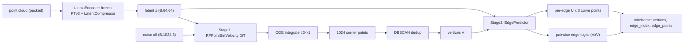

<div align="center">

# CAD Wireframe 神经压缩挑战赛 — RF-Edge 分支

<a href="https://pytorch.org/get-started/locally/"></a>
<a href="https://pytorchlightning.ai/"></a>
<a href="https://github.com/ashleve/lightning-hydra-template"></a><br>

</div>

比赛主页: https://mathmagic-official.github.io/AICAD/

数据集以及 Baseline: https://pan.ustc.edu.cn/share/index/8902361d3b5745f78245

## 框架概览

`点云 -> 冻结 Utonia PTv3 + 可训练 compressor -> z(64×64=4096) -> Rectified Flow 解码角点 -> 去重出顶点 V -> EdgePredictor 以 z 为条件预测顶点间的连边 + 每条边的曲线`。
两个**独立训练**的阶段拼成完整流水线:**Stage 1** 把点云压成 latent,再用 rectified flow 解码出固定尺寸的
**角点点集**(每个点都是 wireframe 的一个顶点 / 角点),DBSCAN 去重还原成顶点集 `V`;**Stage 2** 用一个以 `z` 为
条件的 `EdgePredictor`,对**每一对顶点**预测是否有边相连(对称 pairwise 连边头 + 沿候选边的 `z` 几何证据),并对
选中的边回归出 `U×3` 的曲线点。



| 模块 | 阶段 | 作用 |
| --- | --- | --- |
| **UtoniaEncoder** (冻结 `Utonia PTv3` + 可训练 `LatentCompressor`) | Stage 1 & 2 | **原始变长点云**(打包成 `coord (ΣN,3)` + `offset (B,)`,PTv3 原生格式) → 体素去重(每体素留一点,对齐 Utonia 的 GridSample 推理) → 冻结的 [Utonia](https://huggingface.co/Pointcept/Utonia) 预训练 PTv3 编码器(`eval` + `no_grad`,确定性)出粗粒度逐体素特征 → 可训练 compressor 池化成 latent `z (B,64,64)`。`64×64=4096` floats 正好是比赛 latent 预算上限。**两个阶段各有一份独立、从头训练的 compressor**;只有 PTv3 backbone 在两边都冻结。 |
| **RFPointSetVelocity** (点集 DiT) | Stage 1 | 以 `z` 为条件的置换等变速度场,输出 **3 通道** xyz 速度:对 `1024` 个点做全局 self-attention + 对 64 个 latent token 的 cross-attention,时间步用正弦嵌入 + AdaLN-Zero 注入。注意力走 `scaled_dot_product_attention`(Flash / memory-efficient),自注意力显存 `O(N)` 而非 `O(N²)`,可选 gradient checkpointing。 |
| **EdgePredictor** (顶点 Transformer) | Stage 2 | 顶点编码器 = `Linear(3→d)` + `depth` 个 [顶点 self-attention(带 padding mask)+ 对 `z` 的 cross-attention] 块 → 逐顶点特征 `h`。**连边存在性头**(对称无向):对每个点对 `(i,j)` 构造 `[h_i+h_j, |h_i−h_j|, h_i*h_j, dist, dir]`(可拼接沿边 `z` 证据)→ MLP → 整张 `(V,V)` logit 矩阵。**沿边几何证据**(PC2WF 风格):在候选线段 `a→b` 上采样 `M` 个点 cross-attend 到 `z`、池化后喂给连边头,让连边依赖真实形状证据。**曲线头**(prune-then-refine):只在被选中的边上跑(训练用 GT 正样本,推理用阈值后正样本),从 `[h_i,h_j,端点,z]` 预测直线 baseline 上的 `U×3` 残差,残差乘 `sin(πt)` 包络把端点钉死到两个顶点。详见 `src/models/edge_predictor.py`。 |

## 目标点集 (target)

每个样本产出固定尺寸的 Stage-1 目标点集 `wf_points (N=1024, 3)`:把 GT 顶点(角点)**有放回随机上采样**到恰好
`1024` 个点 —— 采样得到的点是真实角点的**精确复制**(不加抖动)。在置换不变点集上,逐样本 OT 耦合于是会把多个噪声点
匹配到同一个角点,让速度场学会把噪声云搬运到那一小撮真实角点上;推理时再用 DBSCAN 把采样云收回成顶点。

- **Stage 1** 用这 `(N,3)` 角点集作为 rectified-flow 的 `x1`,同时保留原生 GT 图(顶点 / 边)供可选的 `val/vpe` 评估。
- **Stage 2** 用同一套数据加载,但只取 GT 顶点 + 连边 / 曲线作为监督(`collate_rf_batch` 把原生 GT 图透传到
  `gt_wireframes`)。

本分支用**原始(未清洗)数据**(`train/sample_edge` + `data/split.json`),两个阶段共用同一套加载/过滤逻辑:坏文件
跳过、`ne < min_edges` 跳过、`nv > max_vertices` 或 `ne > max_edges` 的病态超大 wireframe 丢弃、空点云跳过。Stage 1
把 `max_vertices` 设为 `1024`(必须 `≤ wf_num_points`,否则上采样无法覆盖所有角点);Stage 2 把 `max_vertices` 设为
`EdgePredictor` 的 `vmax`(默认 `1024`,与 Stage 1 一致,即 padding 后 `V×V` 邻接矩阵的上限)。

## 训练

两个阶段各自独立训练(不共享权重、不端到端联合)。

### Stage 1 — 角点 Rectified Flow

依赖:除点云栈(Utonia PTv3 需 `spconv` / `flash-attn` / `torch_scatter` / `timm`)外,RF 分支还需
[`torchcfm`](https://github.com/atong01/conditional-flow-matching)(`ConditionalFlowMatcher`)
与 [`torchdiffeq`](https://github.com/rtqichen/torchdiffeq)(`odeint`)。Utonia 权重默认从本地
`logs/utonia/utonia.pth` 加载(在 `configs/rf*.yaml` 的 `pc_encoder.utonia` 配置;也可填 HF 名 `utonia` +
`utonia_repo_id: Pointcept/Utonia` 走自动下载)。

训练是 **1-rectified flow + 逐样本最优传输(OT)耦合**:`x1=wf_points (1024,3)`、`x0~N(0,I)`,在**每个样本内部**用
熵正则 Sinkhorn(`ot_couple_noise`,平方欧氏 cost、log 域稳定)把 `N` 个噪声点重排到与 `N` 个角点对齐,再用
`ConditionalFlowMatcher(sigma=0)` 给出 `(t, xt, ut)`,网络出速度 `v=net(t,xt,z)`,损失 `loss = w_xyz · MSE(v, ut)`。

> **为什么必须 OT**:目标是置换不变点集,随机/独立配对会让逐点速度目标 `ut=x1-x0` 自相矛盾,其 Bayes 最优回归塌成
> 把噪声往数据质心收缩的均值场(模型退化成一团 blob)。OT 把每个目标点配到附近的噪声点,才让速度可学。耦合在
> `no_grad` 下只选 `(x0,x1)` 配对,不回传梯度。

验证默认只算 flow-matching 的 `val/loss`,checkpoint 按它选;打开 `val_vpe: true` 后会额外 ODE 采样 + DBSCAN 去重,
对还原出的顶点与 GT 角点算 vertex chamfer 记为 `val/vpe`,让 checkpoint 也能按角点质量排序。`predict_step` 用固定噪声
种子做确定性 ODE 采样并去重,输出角点云 + `vertices` 喂给 Stage 2。

```bash
# 单 GPU
python -m src.main fit --config configs/data.yaml --config configs/rf.yaml
# 也可以： bash scripts/run.sh train

# 8x A800 DDP
python -m src.main fit --config configs/data.yaml --config configs/rf_ddp.yaml
# 也可以： bash scripts/run.sh train_ddp
```

显存/速度杠杆:`rf_net.{depth,d_model,nhead}`、`data.batch_size`、`wf_num_points (N)`、`rf_net.grad_checkpoint`。

可用 `scripts/vis_rf_val.py` 可视化 `输入点云 | GT 角点 | 去重还原的角点`,并打印逐形状 VPE / 角点数量:

```bash
python scripts/vis_rf_val.py --ckpt logs/pc2wireframe/<run-id>/checkpoints --num 6
```

### Stage 2 — 连边预测 (EdgePredictor)

Stage 2 在 **GT 顶点**上训练(以 `z` 为条件),并对训练输入施加增强来弥合到 Stage 1 带噪去重输出之间的 gap:
顶点 xyz 抖动 + 少量**伪造顶点**(邻接行全 0,逼模型对多余角点判"无边")+ 可选顶点 dropout。监督由两项加权而成:

- `loss_edge`:对所有有效点对的连边 BCE。绝大多数点对都不是边,负类严重不均衡,默认用 **focal loss**(也可切到
  `bce` + `edge_pos_weight`)。
- `loss_curve`:在 GT 正样本边上,对预测的 `U×3` 曲线点与 GT 曲线点做**顺序无关**的 smooth-L1(正反向取小)。

验证时喂**干净的 GT 顶点**(不加增强),对连边 logit 阈值化 + 对称化 + 去自环,组装成 wireframe,用与 Stage 1 同一套
`val/{score,ccd,ta,vpe}` 打分(`monitor: val/score`,`mode: max`)。

```bash
# 单 GPU
python -m src.main fit --config configs/edge.yaml
# 也可以： bash scripts/run.sh train_edge

# 8x A800 DDP
python -m src.main fit --config configs/edge.yaml --config configs/edge_ddp.yaml
# 也可以： bash scripts/run.sh train_edge_ddp
```

> **关于 `vmax` / 显存**:连边头一次性算整张 `V×V` 矩阵、沿边证据再乘 `M` 个采样点,显存随 `vmax²` 增长。`vmax`
> 默认 `512`(与 Stage 1 的 `data.max_vertices=512` 一致,顶点数超过的形状会被丢弃),`pair_dim` 把 pairwise 特征宽度
> 压小以控显存;单卡 `batch_size` 默认 `8`,显存吃紧时再调小 `batch_size` / `edge_evidence_points` 或降低 `vmax`
> (数据中顶点数中位数约 160、`p75≈436`)。

> **关于 decode 阈值**:focal / `pos_weight` 训练会把最优判定点推离 `0.5`,所以固定阈值并不可靠。每个验证 epoch 会在
> `edge_thresholds` 上扫一遍、取使 `val/score` 最大的阈值并持久化到 `best_edge_threshold`(随 ckpt 保存),推理时默认用
> 它而非 `0.5`;`edge_threshold` 只是首个验证之前的兜底值。日志里 `val/score@<thr>` 给出每个阈值的得分,`val/edge_threshold`
> 给出当前选中的阈值。

## 推理 / 提交

```bash
# Stage 1:点云 -> 角点云 + 去重顶点
python -m src.main predict --config configs/data.yaml --config configs/rf.yaml \
    --ckpt_path <rf.ckpt>
# 也可以： CKPT=<rf.ckpt> bash scripts/run.sh predict
```

预测在每形状的归一化坐标系下进行,再用 `pc_center` / `pc_scale` 映射回原始 CAD 坐标。把 Stage 1 去重出的顶点喂给
Stage 2 的 `EdgePredictor` 即得到完整 wireframe(完整两阶段串联的提交脚本留给调用方按需组装)。
