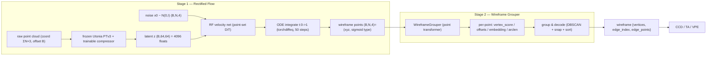

<div align="center">

# CAD Wireframe 神经压缩挑战赛 — Rectified Flow 分支

<a href="https://pytorch.org/get-started/locally/"></a>
<a href="https://pytorchlightning.ai/"></a>
<a href="https://hydra.cc/"></a>
<a href="https://github.com/ashleve/lightning-hydra-template"></a><br>

</div>

比赛主页: https://mathmagic-official.github.io/AICAD/

数据集以及 Baseline: https://pan.ustc.edu.cn/share/index/8902361d3b5745f78245

## 框架概览

`点云 -> 冻结 Utonia PTv3 + 可训练 compressor -> z(64×64=4096) -> Rectified Flow 去噪点集(xyz,type) -> Wireframe Grouper 重建 wireframe`。
两个**独立训练**的阶段拼成完整流水线:**Stage 1** 把点云压成 latent 再用 rectified flow 解码出一个固定尺寸的
wireframe 点集;**Stage 2** 用一个学习式 grouper(点云 Transformer)把这堆带噪点集重建成结构化的 wireframe 图,
取代脆弱的手写规则重建。


| 模块 | 阶段 | 作用 |
| --- | --- | --- |
| **UtoniaEncoder** (冻结 `Utonia PTv3` + 可训练 `LatentCompressor`) | Stage 1 | **原始变长点云**(打包成 `coord (ΣN,3)` + `offset (B,)`,PTv3 原生格式) → 体素去重(每体素留一点,对齐 Utonia 的 GridSample 推理) → 冻结的 [Utonia](https://huggingface.co/Pointcept/Utonia) 预训练 PTv3 编码器(`eval` + `no_grad`,确定性)出粗粒度逐体素特征 → 可训练 compressor 池化成 latent `z (B,64,64)`。`64×64=4096` floats 正好是比赛 latent 预算上限。backbone 冻结、只训 compressor。 |
| **RFPointSetVelocity** (点集 DiT) | Stage 1 | 以 `z` 为条件的置换等变速度场:对 `8192` 个点做全局 self-attention + 对 64 个 latent token 的 cross-attention,时间步用正弦嵌入 + AdaLN-Zero 注入。注意力走 `scaled_dot_product_attention`(Flash / memory-efficient),`8192` 点自注意力显存 `O(N)` 而非 `O(N²)`,可选 gradient checkpointing。 |
| **WireframeGrouper** (点集 Transformer) | Stage 2 | 学习式重建,取代手写规则。对每个点回归 `vertex_score / vertex_offset / endpoint_offset / embedding / arclen`(VoteNet 投票 + associative-embedding 风格),解码即 DBSCAN 聚类顶点中心 + 把每条边的两个投票端点 snap 到顶点恢复 `edge_index` + 按 `arclen` 排序恢复曲线。详见 `src/models/wireframe_grouper.py`、`src/recon/grouped.py`。 |
| **传统重建** (`src/recon/traditional.py`) | (legacy) | RF 采样出的点集 `(N,4)` → wireframe 的纯确定性 baseline:顶点 = 对 `type≈1` 的点做半径合并聚类;边 = "最近两顶点投票";边曲线 = 其支撑点按投影排序后重采样。无学习,作为 grouper 的对照与 fallback 保留。 |



## 目标点集 (RF target)

每个样本产出固定尺寸的目标点集 `wf_points (N=8192, 4)`,每点 `(x, y, z, type)`。`type` 在训练时是
`{0,1}` 标签(顶点=1 / 边=0),作为分类目标(见下文 x1-prediction BCE);推理时采样得到 logit,过
`sigmoid` 后按 `0.5` 阈值二分。类型**不预留固定配比**,由数据决定:

- 全部 GT 顶点 → `type=1`(顶点数 `V > N` 的极端原始样本对顶点做下采样);
- 其余 `N - V` 个点 → 对所有边折线做**全局弧长采样**,`type=0`。

本分支用**原始(未清洗)数据**(`train/sample_edge` + `data/split.json`),并用 `max_vertices=max_edges=1024`
跳过病态超大 wireframe(`nv > max_vertices` 或 `ne > max_edges` 的样本直接丢弃),把目标分布控制在合理量级内。

## 训练

两个阶段各自独立训练(不共享权重、不端到端联合)。

### Stage 1 — Rectified Flow

依赖:除点云栈(Utonia PTv3 需 `spconv` / `flash-attn` / `torch_scatter` / `timm`)外,RF 分支还需
[`torchcfm`](https://github.com/atong01/conditional-flow-matching)(`ConditionalFlowMatcher` + `OTPlanSampler`)
与 [`torchdiffeq`](https://github.com/rtqichen/torchdiffeq)(`odeint`)。Utonia 权重默认从本地
`logs/utonia/utonia.pth` 加载(在 `configs/rf*.yaml` 的 `pc_encoder.utonia` 配置;也可填 HF 名 `utonia` +
`utonia_repo_id: Pointcept/Utonia` 走自动下载)。

训练是 **minibatch-OT 耦合的 rectified flow**:`x1=wf_points`、`x0~N(0,I)`,先按 xyz 代价做 OT 把
噪声/目标点集配对(`coupling: ot`,让流线更直、条件 `z` 更被用上),再用 `ConditionalFlowMatcher(sigma=0)`
给出 `(t, xt, ut)`,网络出速度 `v=net(t,xt,z)`。损失**拆两路**:

- 几何:`loss_xyz = MSE(v[:3], ut[:3])`(速度回归);
- 类型:`loss_type = BCEWithLogits((xt+(1-t)·v)[type], x1[type], pos_weight)`(x1-prediction 分类,
  `type_pos_weight` 抵消顶点稀有);
- 合并 `loss = w_xyz·loss_xyz + w_type·loss_type`,三项都 log。

验证用固定噪声种子做确定性 ODE 采样(`ode_steps=50` euler),type 通道过 `sigmoid` 后再走重建,计算
`val/{score,ccd,ta,vpe}`。

```bash
# 单 GPU
python -m src.main fit --config configs/data.yaml --config configs/rf.yaml
# 也可以： bash scripts/run.sh train

# 8x A800 DDP
python -m src.main fit --config configs/data.yaml --config configs/rf_ddp.yaml
# 也可以： bash scripts/run.sh train_ddp
```

显存/速度杠杆:`rf_net.{depth,d_model,nhead}`、`data.batch_size`、`wf_num_points (N)`、`rf_net.grad_checkpoint`。

### Stage 2 — Wireframe Grouper

Grouper 不接触点云编码器:它**直接在 GT wireframe 点集上训练**,并对输入加噪(`jitter_std` 抖动 xyz、
`type_noise_std` 扰动 type 通道)来模拟 Stage 1 输出的带噪点集。每点回归 5 组监督量(顶点/边分类 BCE、
顶点中心投票 smooth-L1、端点投票 order-invariant smooth-L1、弧长 MSE、判别式实例 embedding),验证时做
group & decode 并计算同一套 `val/{score,ccd,ta,vpe}`,与传统重建直接可比。

```bash
# 单 GPU
python -m src.main fit --config configs/grouper_data.yaml --config configs/grouper.yaml
# 也可以： bash scripts/run.sh train_grouper

# 8x A800 DDP
python -m src.main fit --config configs/grouper_data.yaml --config configs/grouper_ddp.yaml
# 也可以： bash scripts/run.sh train_grouper_ddp
```

下图为 grouper 验证集重建示例(左:GT wireframe;中:grouper 预测 + 逐样本 `score/ccd/ta/vpe`;右:输入带噪点集):


## 推理 / 提交

```bash
python -m src.main predict --config configs/data.yaml --config configs/rf.yaml \
    --ckpt_path <rf.ckpt>
# 也可以： CKPT=<rf.ckpt> bash scripts/run.sh predict
```

预测在每形状的归一化坐标系下进行,再用 `pc_center` / `pc_scale` 映射回原始 CAD 坐标。

## 数据清洗(可选工具)

RF 分支默认直接吃原始数据,但仓库仍保留 `scripts/clean_wireframe.py` 作为独立工具(按几何焊接重复顶点 /
删退化边 / 溶解光滑链 / 拆螺旋线)。若想在清洗后的数据上训练,把 `configs/data.yaml` 的
`train_edge_subdir` 指向清洗输出目录、并改用独立的 split 文件即可。

```bash
# 随机洗几个 + 前后对比可视化（也可 --pick worst / --files 指定）
python scripts/clean_wireframe.py test --num 6 --pick random --viz-out logs/clean_preview.png

# 全量清洗（多进程），结果写到 --out-dir，并生成 _clean_report.json 前后分位数对比
python scripts/clean_wireframe.py all \
    --in-dir data/train/sample_edge --out-dir data/train_clean/sample_edge --workers 16
```
